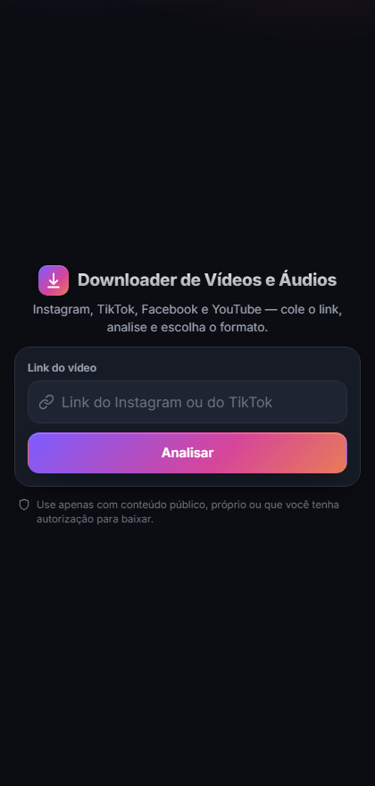
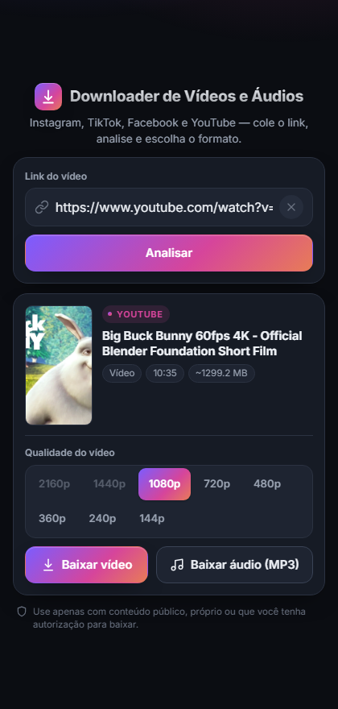

# Downloader de Vídeos e Áudios

Plataforma web para baixar vídeos e áudios de **conteúdo público, próprio ou
autorizado**. Plataformas: **Instagram**, **TikTok**, **Facebook** e **YouTube**.

> YouTube: apenas o que o yt-dlp obtém normalmente, respeitando os Termos e
> direitos autorais. Sem contorno de DRM, restrição de idade ou "members-only".

> Use apenas com conteúdo que você tem direito de baixar. O projeto não
> implementa contorno de login, DRM, paywall, CAPTCHA ou acesso a conteúdo
> privado.

| Colar o link | Prévia + escolha de formato |
|---|---|
|  |  |

<sub>Qualidades acima de `MAX_MEDIA_SIZE_MB` aparecem esmaecidas; a maior que
cabe no limite já vem selecionada.</sub>

## Stack

- Python 3.12+ · FastAPI · Uvicorn
- Frontend: HTML + CSS + JavaScript (vanilla)
- Extração: yt-dlp (isolado atrás da camada de serviço)
- Processamento de áudio: FFmpeg (a partir da FASE 7)

## Estado atual

| Item | Status |
|------|--------|
| Esqueleto FastAPI + roteamento | ✅ |
| Interface (colar link → analisar → prévia), responsiva 320–1920 | ✅ |
| Validação de URL + allowlist de plataforma + anti-SSRF | ✅ |
| Instagram Service (metadados reais via yt-dlp) + cache | ✅ |
| `POST /api/analyze` | ✅ retorna metadados reais |
| Download (vídeo/áudio) com **progresso em tempo real (SSE)** | ✅ |
| `POST /api/download` → job; `GET .../events` (SSE); `GET .../file` | ✅ |
| Limpeza por TTL de sobras em `storage/temp` | ✅ (varredura no boot + periódica) |
| Tratamento de erros centralizado (JSON padrão, sem stack trace) | ✅ |
| Segurança: rate limit, headers/CSP, guarda de corpo, CORS/Host | ✅ (ver [SECURITY.md](SECURITY.md)) |
| Deploy: Docker + Compose + exemplo nginx | ✅ |
| TikTok (mesmo contrato; detecção automática de plataforma) | ✅ |
| Facebook (watch / reel / vídeos de página / fb.watch) | ✅ |
| YouTube (watch / shorts / youtu.be; merge via FFmpeg) | ✅ |

### FFmpeg (necessário para o áudio)

```powershell
winget install --id Gyan.FFmpeg -e
```

Se o `ffmpeg` não estiver no `PATH`, informe o caminho em `FFMPEG_PATH` no `.env`.

### Cookies (acesso autenticado)

Instagram, TikTok e Facebook costumam recusar leitura sem login (*"O X está
exigindo login..."*). Para conteúdo **seu ou público**, dê cookies da sua conta
ao servidor — duas formas, no `.env`:

**A. Arquivo de cookies** (formato Netscape / `cookies.txt`):

```
INSTAGRAM_COOKIES_FILE=C:\caminho\absoluto\cookies.txt
```

Exporte com uma extensão tipo *"Get cookies.txt LOCALLY"* estando logado. Use
caminho **absoluto**. Nunca comite o arquivo.

**B. Ler direto do navegador logado** (ignora o arquivo acima se ambos existirem):

```
INSTAGRAM_COOKIES_FROM_BROWSER=edge      # chrome | firefox | brave | ...  ("chrome:Perfil 1" p/ perfil)
```

> No Windows, o navegador **precisa estar fechado** — ele trava o banco de
> cookies e a leitura falha (*"Feche o navegador e tente de novo"*). Nesse caso
> use a opção A.

Cada plataforma tem seu par (`TIKTOK_COOKIES_FILE` / `..._FROM_BROWSER`, etc.).
YouTube geralmente funciona sem cookies.

### Testes e lint

```bash
.venv\Scripts\python.exe -m pip install -r requirements-dev.txt
.venv\Scripts\python.exe -m pytest
.venv\Scripts\python.exe -m pyflakes app
```

CI (GitHub Actions, [.github/workflows/ci.yml](.github/workflows/ci.yml)):
pyflakes + pytest (com FFmpeg) e build da imagem Docker a cada push/PR.

## Como rodar (desenvolvimento)

```bash
python -m venv .venv
pip install -r requirements.txt        # use .venv\Scripts\python.exe -m pip no Windows
cp .env.example .env

uvicorn app.main:app --reload
```

No Windows, evite `activate` (bloqueio de ExecutionPolicy) e chame o Python do
venv direto — ou use `run.bat` (duplo clique).

Acesse http://127.0.0.1:8000 · Documentação da API: http://127.0.0.1:8000/docs
(desativada quando `APP_DEBUG=false`).

## Estrutura

```
app/
  main.py            FastAPI: rotas, middlewares, exception handlers, lifespan
  api/               endpoints analyze/download + schemas
  core/              config, logger, security (SSRF/path), cleanup, ratelimit, middleware
  services/          registry, base, validator, errors, downloader, media,
                     ytdlp + ytdlp_service (núcleo comum), jobs (progresso SSE),
                     instagram, tiktok, facebook, youtube
  utils/             cache (TTL)
templates/index.html
static/css · static/js
storage/temp/        arquivos temporários (apagados após entrega + varredura por TTL)
tests/               pytest (rede/yt-dlp/FFmpeg mockados)
Dockerfile · docker-compose.yml · deploy/nginx.conf
```

## Configuração (`.env`)

Ver [.env.example](.env.example). Nunca comitar `.env`, cookies ou `storage/temp`.

## Deploy (produção)

Linux + Docker atrás de um nginx. O container traz FFmpeg embutido.

```bash
cp .env.example .env
#  APP_ENV=production   APP_DEBUG=false   (desliga /docs)
#  ALLOWED_HOSTS=baixa.exemplo.com
#  INSTAGRAM_COOKIES_FILE=/secrets/cookies.txt   (opcional)

docker compose up -d --build
docker compose logs -f app
```

O serviço fica em `127.0.0.1:8000` (só o nginx do host acessa). Use
[deploy/nginx.conf](deploy/nginx.conf) como base do proxy reverso e emita o
certificado TLS com `certbot`.

Sem Docker: `pip install -r requirements.txt` e
`uvicorn app.main:app --host 0.0.0.0 --port 8000 --proxy-headers --forwarded-allow-ips='*'`
como serviço `systemd`, com FFmpeg no `PATH`.

> **Escala:** o rate limit é em memória, por processo. Rodando com
> `WEB_CONCURRENCY>1` ou várias réplicas, cada uma conta seu próprio limite —
> para um limite global, usar storage compartilhado (`slowapi` + Redis).

## Roadmap

FASES 1–15 concluídas: Estrutura · Interface · Validador de URL · Instagram
Service · Metadados · Download de vídeo · Áudio · Temporários · Erros ·
Segurança · Responsividade · Deploy · TikTok · Facebook · YouTube.

Extra já feito: **progresso de download em tempo real (SSE)** — `POST /api/download`
cria um job, `GET /api/download/{id}/events` transmite estado + %, `GET
/api/download/{id}/file` entrega o arquivo pronto (e apaga o job).

Próximos passos possíveis: fila (RQ/Redis) sob volume, histórico opcional,
API pública com autenticação.
